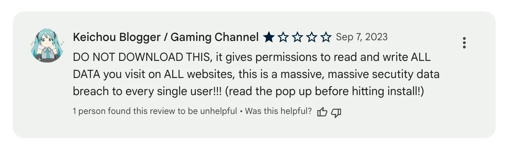
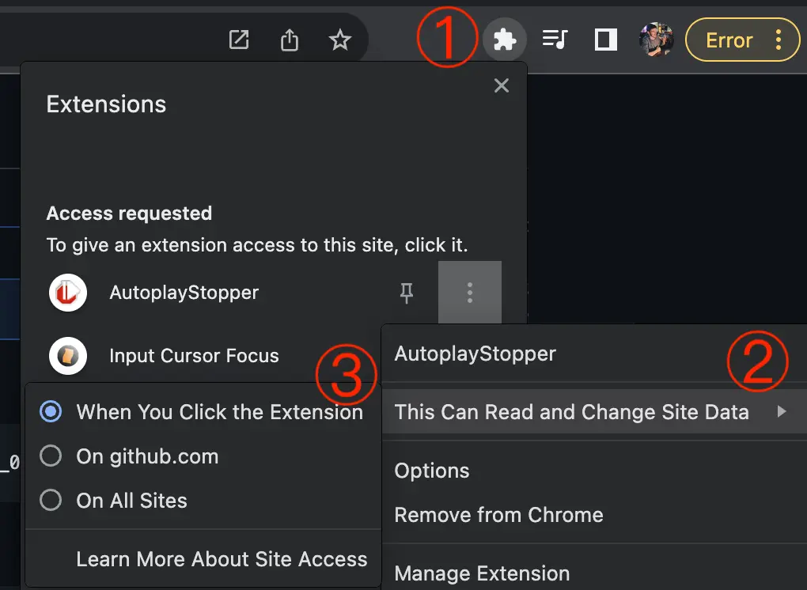
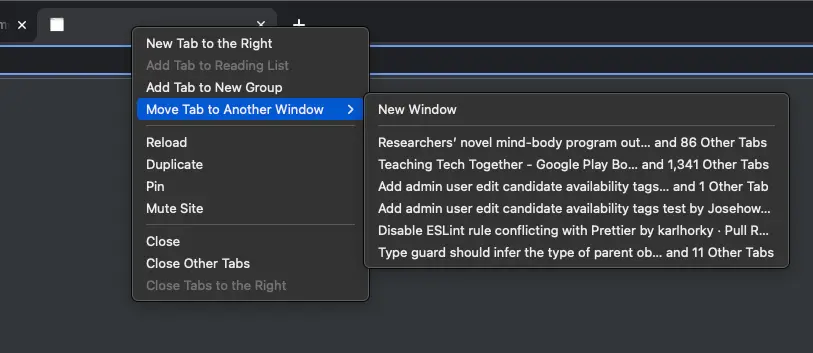

# Chrome Tricks

A collection of tricks for Google Chrome

## Open New Tab Next to Current Tab

On macOS, this can be done by changing App Shortcuts:

1. Open **System Preferences** and navigate to Keyboard > Shortcuts > App Shortcuts
2. Click the `+` button and create a shortcut to free up the `⌘T` shortcut (if you skip this step, the other shortcut will not work):
   1. Application: Google Chrome
   2. Menu Title: `New Tab` (match capitalization exactly)
   3. Keyboard Shortcut: Press <kdb>`⌘`</kbd>-<kdb>`⌥`</kbd>-<kdb>`T`</kbd>
   4. Click `Add`
3. Click the `+` button and fill in the following details:
   1. Application: Google Chrome
   2. Menu Title: `New Tab to the Right` (match capitalization exactly)
   3. Keyboard Shortcut: Press <kdb>`⌘`</kbd>-<kdb>`T`</kbd>
   4. Click `Add`

Now the default when using the `⌘T` shortcut (<kdb>`cmd`</kdb>-<kdb>`T`</kdb>) will be to open a tab to the right of your current tab, which is a much nicer UX. If you want to open a tab at the end of all of the tabs, use the shortcut `⌘⌥T` (<kdb>`cmd`</kdb>-<kdb>`alt`</kdb>-<kdb>`T`</kdb>).

Credit for this trick goes to to `mblakesley` for [their answer on Super User](https://superuser.com/a/1704081/157255)

For other operating systems, check out [the other answers on Super User](https://superuser.com/questions/1103354/keyboard-shortcut-to-open-new-tab-next-to-current-tab-in-google-chrome).

## Reduce Browser Extensions Security Surface Area

The longer that I use the Internet and web browsers, the more that any browser extensions make me nervous, since they often have access to all data on websites that you visit:

So I would recommend that everyone reduce reliance on browser extensions:

1. Uninstall all browser extensions you don't need (if you can do the workflow in a different or manual way, do it)
2. Check the publisher of all extension and consider whether you trust the company or person (big tech companies with security focus eg. Google and Meta are probably pretty trustworthy)
3. Restrict all browser extensions you cannot uninstall to only activate when you click on them:
   1. Click on puzzle piece top right
   2. Click on the three dots next to extension -> "This can read and change site data"
   3. Choose "when I click the extension"
   4. Optional: when you want to enable the extension permanently for specific websites containing less sensitive information, choose "On <domain>" when on the website
   
4. Use a separate browser with zero browser extensions for very sensitive things

## Show Tab Count in Window

If you have a high number of tabs in a Chrome window, it can be difficult to know how many total tabs you have open.

To get a count of tabs in each window, right click on any tab and select **Move Tab to Another Window**.

The items in the flyout menu show the number of tabs in the other windows:

